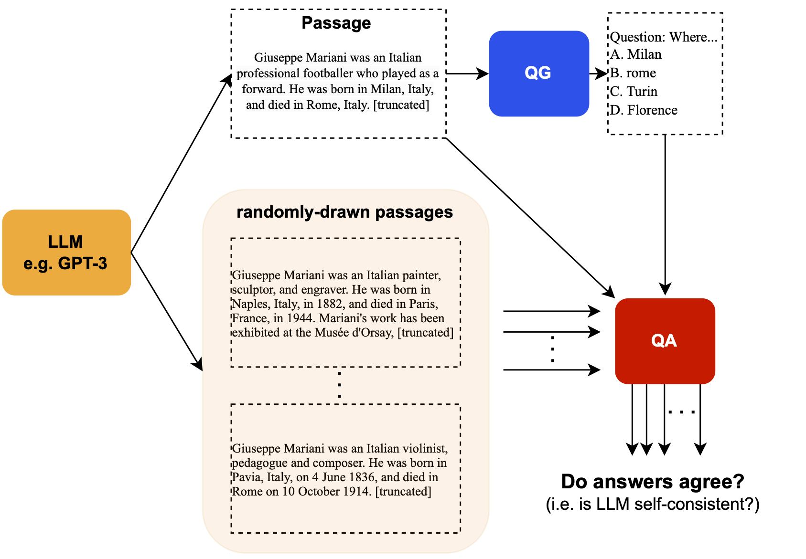

SelfCheckGPT
=====================================================
- Project page for our paper "[SelfCheckGPT: Zero-Resource Black-Box Hallucination Detection for Generative Large Language Models](https://arxiv.org/abs/2303.08896)"
- The paper on arxiv has recently been updated on 5 May 2023 to include SelfCheckGPT with n-gram experiments, and the dataset has been annotated further to include 238 passages.  



## Code/Package

### Installation

    pip install selfcheckgpt

### SelfCheckGPT Usage

Both `SelfCheckMQAG()` and `SelfCheckBERTScore()` have `predict()` which will output the sentence-level scores w.r.t. sampled passages. You can use packages such as spacy to split passage into sentences. For reproducibility, you can set `torch.manual_seed` before calling this function. See more details in Jupyter Notebook [```demo/SelfCheck_demo1.ipynb```](demo/SelfCheck_demo1.ipynb)

```python
# Include necessary packages (torch, spacy, ...)
>>> from selfcheckgpt.modeling_selfcheck import SelfCheckMQAG, SelfCheckBERTScore
>>> selfcheck_mqag = SelfCheckMQAG() # set device to 'cuda' if GPU is available
>>> selfcheck_bertscore = SelfCheckBERTScore()

# LLM's text (e.g. GPT-3 response) to be evaluated at the sentence level  & Split it into sentences
>>> passage = "Michael Alan Weiner (born March 31, 1942) is an American radio host. He is the host of The Savage Nation."
>>> sentences = [sent.text.strip() for sent in nlp(passage).sents] # spacy sentence tokenization
>>> print(sentences)
['Michael Alan Weiner (born March 31, 1942) is an American radio host.', 'He is the host of The Savage Nation.']

# Other samples generated by the same LLM to perform self-check for consistency
>>> sample1 = "Michael Alan Weiner (born March 31, 1942) is an American radio host. He is the host of The Savage Country."
>>> sample2 = "Michael Alan Weiner (born January 13, 1960) is a Canadian radio host. He works at The New York Times."
>>> sample3 = "Michael Alan Weiner (born March 31, 1942) is an American radio host. He obtained his PhD from MIT."

# SelfCheck-MQAG: Score for each sentence where value is in [0.0, 1.0] and high value means non-factual
# Additional params for each scoring_method:
# -> counting: AT (answerability threshold, i.e. questions with answerability_score < AT are rejected)
# -> bayes: AT, beta1, beta2
# -> bayes_with_alpha: beta1, beta2
>>> sent_scores_mqag = selfcheck_mqag.predict(
        sentences = sentences,               # list of sentences
        passage = passage,                   # passage (before sentence-split)
        sampled_passages = [sample1, sample2, sample3], # list of sampled passages
        num_questions_per_sent = 5,          # number of questions to be drawn  
        scoring_method = 'bayes_with_alpha', # options = 'counting', 'bayes', 'bayes_with_alpha'
        beta1 = 0.8, beta2 = 0.8,            # additional params depending on scoring_method
    )
>>> print(sent_scores_mqag)
[0.30990949 0.42376232]

# SelfCheck-BERTScore: Score for each sentence where value is in [0.0, 1.0] and high value means non-factual
>>> sent_scores_bertscore = selfcheck_bertscore.predict(
        sentences = sentences,                          # list of sentences
        sampled_passages = [sample1, sample2, sample3], # list of sampled passages
    )
>>> print(sent_scores_bertscore)
[0.0099323  0.08978583]
```

## Experiments

### Probability-based baselines (e.g. GPT-3's probabilities)

As described in our paper, probabities (and generation entropies) of the generative LLM can be used to measure its confidence. Check our example/implementation of this approach in [```demo/experiments/probability-based-baselines.ipynb```](demo/experiments/probability-based-baselines.ipynb)


## Dataset
The `wiki_bio_gpt3_hallucination` dataset currently consists of 238 annotated passages (`v3`). You can find more information in the paper or our data card on HuggingFace: https://huggingface.co/datasets/potsawee/wiki_bio_gpt3_hallucination. To use this dataset, you can either load it through HuggingFace dataset API, or download it directly from below in the JSON format.

### Update
We've annotated GPT-3 wikibio passages further, and now the dataset consists of 238 annotated passages. Here is [the link](https://drive.google.com/file/d/1N3_ZQmr9yBbsOP2JCpgiea9oiNIu78Xw/view?usp=sharing) for the IDs of the first 65 passages in the `v1`. 

### Option1: HuggingFace

```python
from datasets import load_dataset
dataset = load_dataset("potsawee/wiki_bio_gpt3_hallucination")
```

### Option2: Manual Download
Download from our [Google Drive](https://drive.google.com/file/d/1AyQ7u9nYlZgUZLm5JBDx6cFFWB__EsNv/view?usp=share_link), then you can load it in python:

```python
import json
with open("dataset.json", "r") as f:
    content = f.read()
dataset = json.loads(content)
```

Each instance consists of:
- `gpt3_text`: GPT-3 generated passage
- `wiki_bio_text`: Actual Wikipedia passage (first paragraph)
- `gpt3_sentences`: `gpt3_text` split into sentences using `spacy`
- `annotation`: human annotation at the sentence level
-  `wiki_bio_test_idx`: ID of the concept/individual from the original wikibio dataset (testset)
-  `gpt3_text_samples`: list of sampled passages (do_sample = True & temperature = 1.0)

## Miscellaneous
[MQAG (Multiple-choice Question Answering and Generation)](https://arxiv.org/abs/2301.12307) was proposed in our previous work. Our MQAG implementation is included in this package, which can be used to: (1) generate multiple-choice questions, (2) answer multiple-choice questions, (3) obtain MQAG score.

### MQAG Usage

```python
from selfcheckgpt.modeling_mqag import MQAG
mqag_model = MQAG()
```

It has three main functions: `generate()`, `answer()`, `score()`. We show an example usage in [```demo/MQAG_demo1.ipynb```](demo/MQAG_demo1.ipynb)

## Citation

```
@misc{manakul2023selfcheckgpt,
      title={SelfCheckGPT: Zero-Resource Black-Box Hallucination Detection for Generative Large Language Models},
      author={Potsawee Manakul and Adian Liusie and Mark J. F. Gales},
      year={2023},
      eprint={2303.08896},
      archivePrefix={arXiv},
      primaryClass={cs.CL}
}
```
